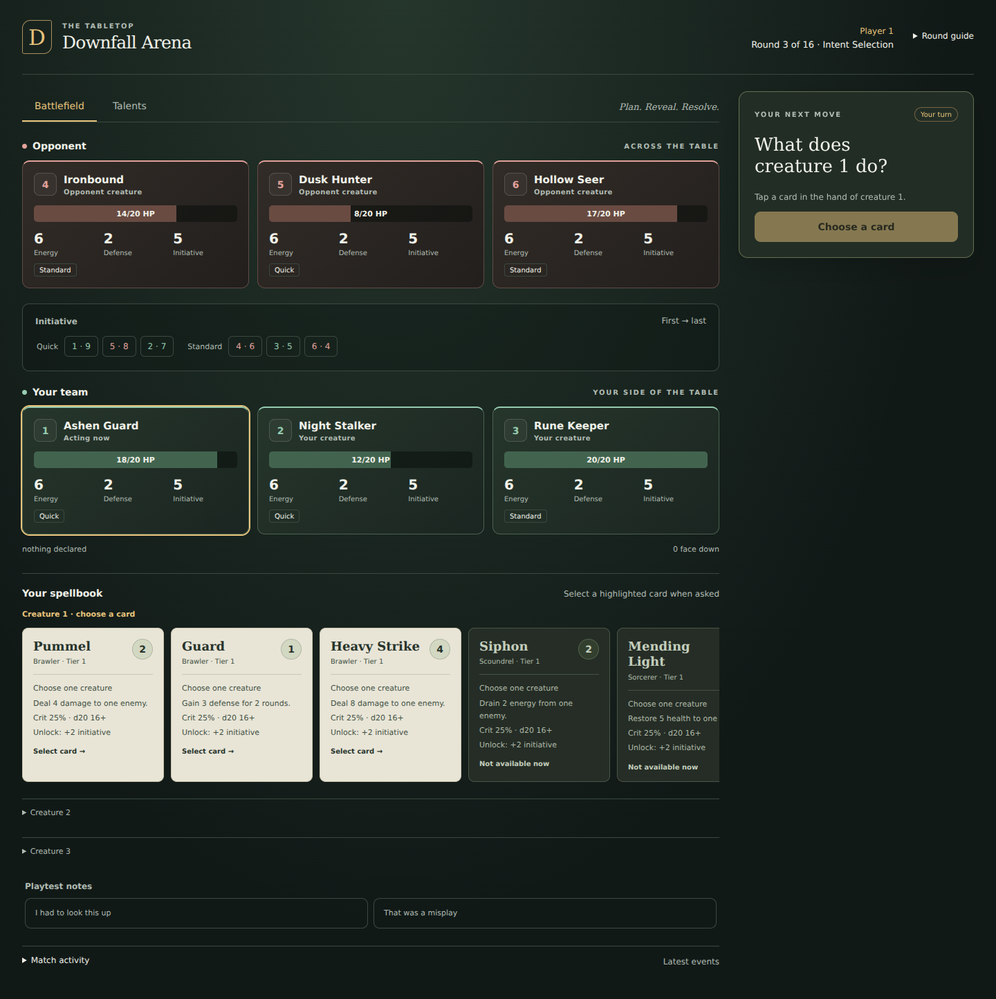
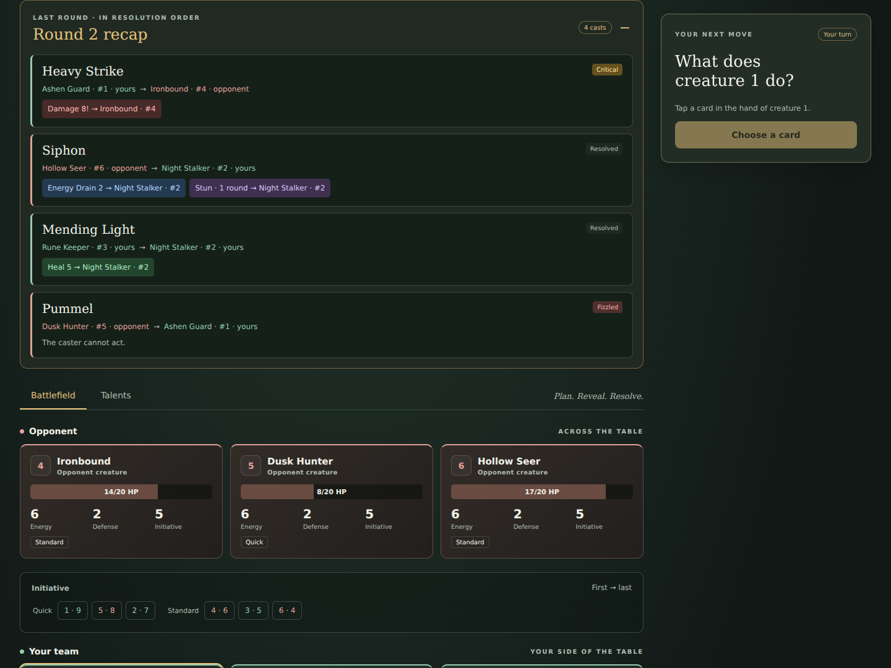

# Downfall Arena table

A static tabletop client designed primarily for desktop, with responsive phone controls, served by the
existing .NET table host. No framework, build step, external fonts, or runtime dependencies. Game rules, legal options and card text still come from the host.

```bash
dotnet run --project src/DownfallArena.Cli -- table --p2 greedy
```

Open the seat link printed by the host. For two people sharing a screen, omit `--p2 greedy` and use the
hotseat link. See [the playtest specification](../docs/tabletop/playtest-app.md) for rules and recording.

## Preview

Earlier visual baseline, before the desktop workspace and floating atlas. These illustrative fixtures are
not recorded matches. Card text and creature names in the actual app come from the running host.





## Playing

- A completed round adds a compact recap button beside the bottom phase guide. Open it to read the
  colour-coded casts, targets and outcomes in a floating panel; it never scrolls or pushes the battlefield.
  It remains available throughout the next round and after the match ends. Escape closes it.
- A persistent bottom guide shows the current phase, round cap and a short reminder. Speeds reveal together;
  opposing spell choices reveal only with confirmed targets. The guide displays this distinction explicitly.
- The opponent, initiative order, your team and your spellbook keep the same reading order on every screen.
- Desktop keeps the battlefield beside a compact planning desk with the acting spellbook. The board stays
  visible while the page scrolls through longer spell lists; neither board nor hand has a clipped inner
  scrolling pane. Cards wrap into two columns and the active creature appears first. Phones retain the
  stacked flow and horizontal hand; jump links remain available below desktop width.
- Gold identifies the acting creature, selected card or target, and the next action. Team names and text
  labels also identify the sides and selection state, so colour is never the only signal.
- Evolution presents one creature's unlocks at a time. Choose its numbered button, then the spell to unlock.
  The visible budget is shared by the team, not per creature. Both the atlas and decision panel show the
  host-configured allowance, remaining picks and spent picks with their creatures; switching creature never
  resets it. The current default is two team picks per round.
- Speed opens the acting creature's spellbook as a readable reference. Each new Speed or Intent question
  keeps the battlefield and planning desk visible together on desktop; smaller screens guide to the
  active decision. Later polls and local selection
  preserve deliberate scrolling. Other hands remain expandable.
- Tap a spell once to select it, then again to declare it. Tap a selected target again to cast on the entire
  selected group once the host's minimum is met. Remove buttons let you correct a target set; single-target
  spells also let you switch by tapping another creature. Declare and Cast buttons remain available.
  Enter or Space works too; holding a key or tapping while a request is pending never submits again.
- The Talent atlas opens over the battlefield as a non-modal window: drag its title, resize its corner,
  maximize, reset or close it. Arrow keys on the title move it as well. Phones use a full-screen panel.
  Its sticky toolbar keeps the creature, round, Evolution pick number and remaining picks visible.
  Down from the last row of spell choices reaches the explorer; Enter opens it and Up returns to spells.
- The atlas draws the actual class hierarchy in three rows for the current catalogue: base, families and
  specializations. Parent links come explicitly from the catalogue projection. Select a class for its full
  spell cards, tiers and exact prerequisites. Branch lines show class ancestry, not individual spell gates.
  Same-tier spells share a compact row on desktop, with no giant full-width cards stacked one by one.
- The authored first-level families use coherent cool, leaf and ember palettes, with shades inherited by
  specializations. These accents follow every card into the spellbook and unlock picker.
- Inspect each creature's known and currently offered spells. Legal Evolution unlocks can be taken directly
  from the atlas; availability still comes exclusively from the pending host options. New Speed, Intent and
  Target questions close the atlas to expose the battlefield.
- Every battlefield creature receives a circular turn number once the host has built the timeline. The
  number follows the full server order, including ties; the active reveal/resolution slot is highlighted.
  Order numbers run from turquoise to violet; Quick tags are gold and Standard tags blue. Energy, defense
  and initiative have separate colours and retain text labels. The order strip spells out creature identity
  and initiative separately. Creature numbers replace repeated definition names in the play surface.
- Spell faces use restrained paper tints with labelled effect and critical badges derived by the catalogue
  projection. The client does not infer effect categories from spell names or parse effect text. The critical
  reminder matches the current engine: either speed can roll a critical, multiplying direct damage/healing.
- Opponent spellbooks expand below their team and update from public known spells as unlocks appear.
  These reference cards never select an action and never expose the opponent's face-down choice.
- Each spell becomes public together with its confirmed targets, in timeline order (ADR 0057).
  The first creature sees no unrevealed enemy choices; the fifth can read the first four confirmed actions.
  Local target selections remain private until confirmation. Confirmed spells, targets and resolution status
  update on the battlefield. At the next round, the previous public action is explicitly
  labelled “Last round” until a new one is revealed; it is recovered from the seat's public feed on reload.
- Round guide contains the host's round order and rule stamp. Match activity and playtest notes stay below
  the spellbook. The opaque handover screen remains the hotseat privacy boundary.

An unchanged poll leaves the DOM alone. Local selection does not wait for another network round trip,
scroll positions and keyboard focus survive a redraw, and a refusal stays visible until a successful
submission or a new question. Only one poll runs at a time, and an old response cannot redraw a board after
a decision has been sent.

## Keyboard

| Key | Action |
| --- | --- |
| 1 / 2 during Speed | Quick / Standard |
| 1–9 during Intent or Target | Select the numbered card or legal target; repeated numbers do not commit |
| Enter | Confirm the selected intent or valid target set; activate a focused button normally |
| 1–9 during Evolution or in the atlas | Choose the creature to evolve or inspect |
| T | Open / close the Talent atlas |
| Escape | Close the atlas; otherwise clear the pending card/target selection |
| ? | Show / hide contextual shortcut help |
| Tab, Enter / Space | Navigate and activate controls, including class nodes and unlocks |
| ← / → | Switch Evolution creatures, or focus the next speed, spell or legal target |
| ↓ from an Evolution creature | Focus its first offered spell |
| ↑ / ↓ within choices | Move to the closest choice in the preceding / following visual row; ↑ from the first Evolution row returns to the creature picker |
| Enter on a spell / target | First selects, then confirms the existing selection; Evolution unlocks use their normal single activation |
| Arrow keys on the atlas title | Move the desktop window |

Shortcuts ignore text fields, selectors, contenteditable areas, modifier chords, key repeats, in-flight
requests and the hotseat fence. Card and target numbers match the host's option order. Arrows follow the visible layout; they never cast or
declare on their own and do not change the engine's acting creature.

## Verification

```bash
node --test studio/*.test.js table/*.test.js
dotnet build
dotnet test
dotnet format --verify-no-changes
```

`table.test.js` runs the shipped renderer in a minimal DOM double using Node's standard library. It covers
stable polling, keyboard selection, asking identity, target bounds, creature-specific unlock lists, the
handover fence, visible refusals, request failures, in-flight poll ordering, decision scrolling, second-tap
confirmation, public opponent books, live public actions, talent filters, keyboard guards and server-derived
turn numbers. Hierarchy and palette tests cover reordered nodes, tree-scoped parents and descendant shades. The feed tests also cover
completed-round recap formatting, event round identity, applied outcomes, failed casts and independent
two-round retention. It complements the existing
projection and transport tests; it does not replace a visual browser check.

For a browser check, exercise Evolution, Speed, Intent and Target, pass the device between seats, inspect
Talents and expand another creature's hand. Check a narrow phone and a desktop, with a scrolled hand and a
slow connection. Verify that only the chosen action is submitted, unavailable cards remain readable, and
that the handover screen covers the entire board.
