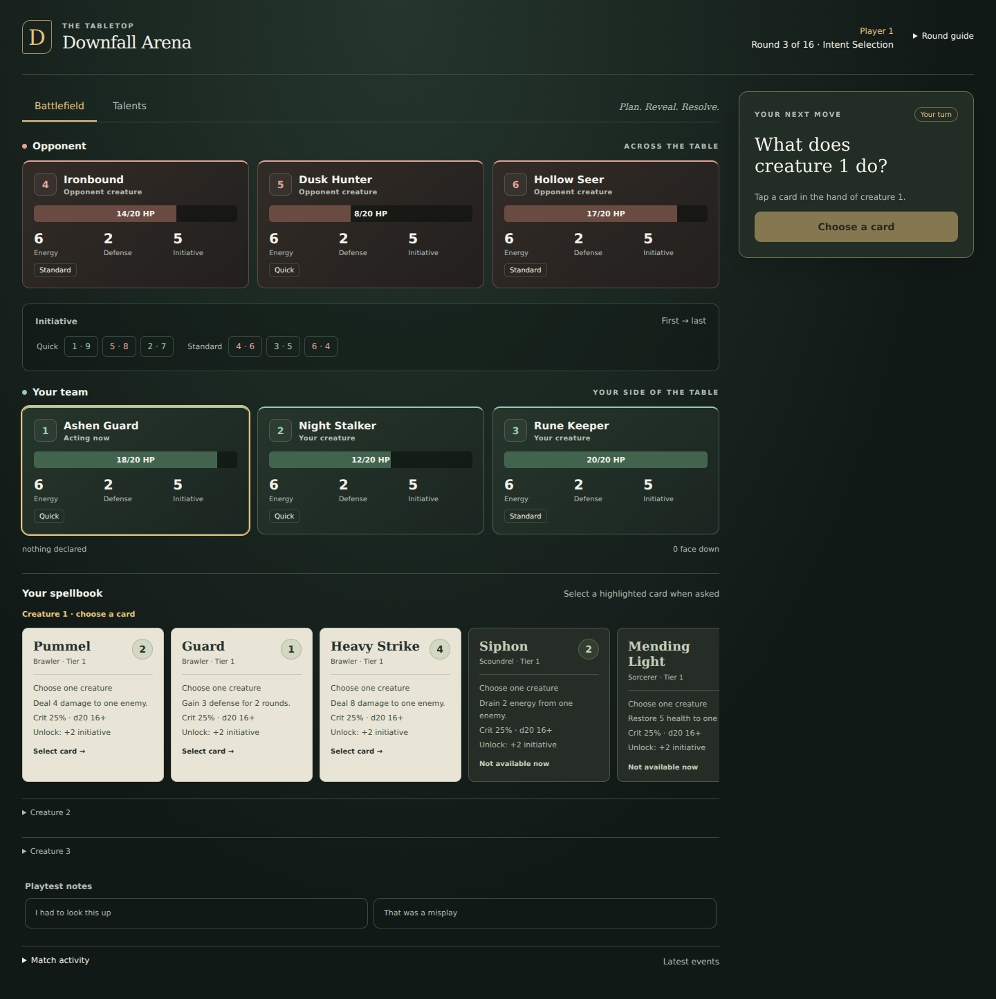
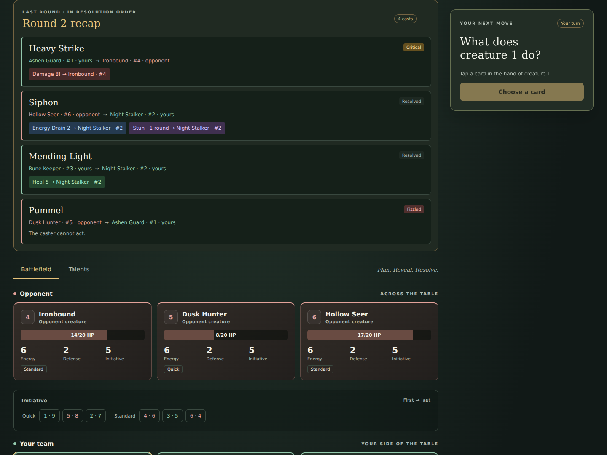

# Downfall Arena table

A static tabletop client designed primarily for desktop, with responsive phone controls, served by the
existing .NET table host. No framework, build step, external fonts, or runtime dependencies. Game rules, legal options and card text still come from the host.

```bash
dotnet run --project src/DownfallArena.Cli -- table --p2 greedy
```

Open the seat link printed by the host. For two people sharing a screen, omit `--p2 greedy` and use the
hotseat link. See [the playtest specification](../docs/tabletop/playtest-app.md) for rules and recording.

## Many tables, one host

The host plays as many tables as an evening needs (ADR 0081). Open `/admin?token=<the operator token the
console prints>` -- the admin panel -- to see them and to open more: choose who sits in each seat and the
format the table plays, read each seat's code to its player, and follow the pilot link to hand a seat over.
The format is each table's own, so a 1v1 and a 3v3 run side by side on one host; the chooser opens on the
host's own, which is what its `--rules` file and `--format` said, and the formats it offers come from the
host rather than from the page. The bots a seat is offered are the
ones `learning/seatable.json` puts forward, then every weights file under `learning/weights/`, read by the
host so a new search is offered without a page change. The panel also lists every recorded session the store
holds, whether or not this host still has its table, deletes one or several (a table still being played is
closed first) and exports one or several as a zip of run directories: unzipped under `runs/`, each is what
`train-clone`, `export-csv` and the viewer read. A table with a person in it waits for every person to
reach their seat before its first question, showing whoever is here the code that brings the other, and then
asks both players their first package pick at the same time (ADR 0092). A table page shows an **Admin** link in its header to the
operator's own browser (the panel keeps the token, or the platform's sign-in says so) and to nobody else.
`/lobby`, the panel's former address, redirects. A host that starts over a store rebuilds every table the
host before it left open, from the seed and the decisions it recorded (`decisions.jsonl`, `table.json`,
ADR 0091): the players' links and codes still reach their seats. `--lobby` starts the host with no table at all, which
is how it runs in its container, and `--platform-auth` makes the platform's sign-in the operator's door
instead of a printed token (ADR 0080). The hosted table runs exactly that, on Azure: see
[infra/README.md](../infra/README.md). From a shell:

```bash
curl -H "X-Seat-Token: <operator token>" -H "Content-Type: application/json" \
  -d '{"player1":"person","player2":"greedy","who":"mk"}' http://127.0.0.1:5099/api/tables
```

## Preview

Earlier visual baseline, before the desktop workspace and floating atlas. These illustrative fixtures are
not recorded matches. Card text and creature names in the actual app come from the running host.





## Playing

- A completed round adds a compact recap button in the sticky top status bar. Open it to read the
  colour-coded casts, targets and outcomes in a floating panel; it never scrolls or pushes the battlefield.
  It remains available throughout the next round and after the match ends. Escape closes it.
- Each action resolves as its targets are confirmed (ADR 0083) and is shown live. The round bar carries one
  line of play-by-play: the action resolved last, the player's own included, or the opponent action being read.
  The opponent's actions are read one at a time before this seat's next question: the decision sheet is headed
  by that action (`Opponent's turn`, its own turn number, its caster and spell) with the seat's question named
  underneath as what comes next, shows the action (caster, targets, outcomes) with the battlefield as it stood
  right after it, and **OK** moves on;
  the question, its controls and its acknowledgement to the host wait until the last one is read, and so does
  the next phase's announcement: a round's last actions are often read once the host has started the next
  round, and the dock stays on the round being read (its combat) until the last OK, when the new round is
  announced, its upkeep ticks read on the board they moved, and the question asked. **Auto this
  round** OKs the rest of that round's opponent actions after a short pause each (and any still to come in
  it); the next round is read by hand again. **Skip all** reads past them at once; Enter or → is OK, Escape is
  Skip all. The seat's own actions are never held, and a reload only asks again for what resolved after the
  seat's own latest action. Once read, the round bar shows the last action and the recap keeps the completed
  sequence. The action resolved last marks its caster and targets on the battlefield with what it changed. A
  completed round is not replayed on its own; the recap's Replay action by action button opens a review
  in the decision column. Previous and Next traverse actual public results (including criticals and
  fizzles); Skip returns to the latest round or match results. The actor and targets are highlighted on the battlefield. Each action starts
  with the recorded Before state; Next applies its After state and shows actual outcomes and stat changes.
  Previous reverses either step. HP, energy, conditions, spellbooks and the timeline come from engine
  snapshots captured before cleanup and upkeep (ADR 0075). Skip restores the latest state including upkeep.
  Older recordings without snapshots explicitly label their battlefield as current totals.
  The next question and its asking acknowledgement wait until the review closes; replay controls send
  no decisions. Arrow keys step backward/forward and Escape skips.
- The sticky top bar leads with round, current phase and the acting position/creature from the host timeline;
  on a phone the acting creature is the outlined chip in its battlefield bar instead.
  The decision repeats the phase and turn position above the creature/spell title; targeting starts with one
  short instruction and keeps confirmation help collapsed. Round flow, upkeep, announcements and recap are
  on-demand references in this same bar. Speeds reveal together;
  opposing spell choices reveal only with confirmed targets. The guide displays this distinction explicitly.
- The opponent, initiative order, your team and your spellbook keep the same reading order on every screen.
- Desktop keeps the battlefield beside a compact planning desk with the acting spellbook. The board stays
  visible while the page scrolls through longer spell lists; neither board nor hand has a clipped inner
  scrolling pane. Cards wrap into two columns and the active creature appears first.
- Below desktop width the battlefield is not a section at the bottom of the page. The round bar carries it
  at a glance, a chip per creature (number, health, energy, defense when it has some, a stun ring; the creature acting now outlined,
  whichever seat is deciding), and a
  Battlefield button that opens the whole battlefield over the page, under the bar; a second tap (or Escape)
  closes it where the player left off, and a handover closes it. A legal target is picked from its chip, so
  a spell aimed at an ally never sends the player past the opponent to find one; any other chip opens the
  battlefield at that creature, and the battlefield opened while a target is asked for starts at the first
  creature the spell may take. A picked chip says that a second tap casts, as its row does. With the
  battlefield shut, arrows walk the legal chips and number keys pick as on a laptop; a chip that opens the
  battlefield hands it the focus, and closing it hands the focus back to its button. In a resolution replay
  the chips mark the caster and its targets and, once the action is applied, what it did to health. The bar
  never widens the page: a long phase name is cut short, and on the narrowest phones a chip showing a health
  change leaves its energy out.
- Phones keep scrolling short and never sideways: the acting creature's spellbook uses two compact columns,
  grouped by the card types the host supplies. **Full details** expands its cards into one column; speed's
  two-column reference reveals each spell's effects on tap. Selecting a spell keeps the cards and the fixed
  decision the same height, so the second tap that commits it lands where the first did. Packages are two-line rows, the
  opened battlefield prints each creature on a few lines with its stats as symbols (ϟ energy, ◇ defense,
  ↟ current initiative), and the turn order wraps. The mini battlefield shows health, energy, defense when
  present and current initiative on each creature. Round flow and the tab row are left to the Round guide and the
  spellbook's Talent atlas link, and the turn in the round bar to the decision heading and the acting chip.
- Gold identifies the acting creature, selected card or target, and the next action. Team names and text
  labels also identify the sides and selection state, so colour is never the only signal.
- Evolution presents one creature's available packages at a time. Each pick buys all of a package's spells
  and its initiative bonus. The team shares two picks on rounds 1, 3, 5, etc. by default, capped by eligible
  living creatures, with at most one package per creature per opportunity (ADR 0066). Both the atlas and
  decision panel show effective remaining and spent picks; switching creature never resets them. The host
  supplies the next evolution round, displayed in the phase guide between opportunities.
- Once speeds are revealed the round bar gains **Turn order**: each side's speeds (the opponent's first) and
  every slot in play order with its initiative and any d20 roll, read off the host's timeline. Below laptop
  width it opens by itself once a round, when the timeline first exists (after a tie order question rather than
  over its buttons), and closes itself after nine seconds or on a tap anywhere on it; a laptop shows the same
  order beside the battlefield, so there it opens on request. Muting the phase pop-ups does not silence it.
  While a spell is chosen, the decision heading and the spellbook rows say where each creature acts (`Acts 2 of 6 · Quick`), since the order is set before intents.
- Speed opens the acting creature's spellbook as a compact reference: name, energy cost and positive
  Standard critical chance, with effects available by expanding a spell. Zero critical stats are omitted
  throughout the spell cards. On phones, the masthead shows the seat and Round guide; round and phase stay
  in the sticky bar. The expanded guide overlays that bar. Each new Speed or Intent question
  keeps the battlefield and planning desk visible together on desktop; smaller screens guide to the
  active decision. Later polls and local selection
  preserve deliberate scrolling. Other hands remain expandable.
- Tap a spell to select it, then tap it again or use the fixed Declare button; the rows do not move between
  the two taps, and choosing a card also closes a phase announcement that would cover that button on a phone.
  With a keyboard, Enter or Space on the chosen card declares it, and the arrow keys reach the Declare button. Tap a selected target again to cast on the entire
  selected group once the host's minimum is met. Remove buttons let you correct a target set; single-target
  spells also let you switch by tapping another creature. Declare and Cast buttons remain available.
  Enter or Space works too; holding a key or tapping while a request is pending never submits again.
- The Talent atlas opens over the battlefield as a non-modal window: drag its title, resize its corner,
  maximize, reset or close it. Arrow keys on the title move it as well. Phones use a full-screen panel.
  Its sticky toolbar keeps the creature, round, Evolution pick number and remaining picks visible.
  Down from the last package or spell choice reaches the explorer; Enter opens it and Up returns to the choices.
- The atlas draws the package prerequisite graph in three rows (tiers 1–3); a phone reads it top to bottom
  instead, one family per block with each upgrade beside the package it grows from, and choosing a package
  brings its spells up with a way back to the list. Names and edges come from
  catalogue packages, not the retired per-spell gates. Select a package to read its prerequisites by name,
  initiative bonus and all its spell faces side by side. Ownership comes from `acquiredTiers`, independently
  of known spells; only the host's `availableTiers` can enable a purchase.
- The authored first-level families use coherent cool, leaf and ember palettes, with shades inherited by
  specializations. These accents follow every card into the spellbook and unlock picker.
- Buy legal packages directly from the atlas. A creature that bought this opportunity remains inspectable
  but cannot buy again. New Speed, TieOrder, Intent and Target questions close the atlas to expose the board.
- The initiative strip retains d20 rolls and rerolls. TieOrder has its own phase reminder and guarded
  keyboard/pointer controls to order your creatures within your side's assigned places before declarations.
- Every battlefield creature receives a circular turn number once the host has built the timeline. The
  number follows the full server order, including ties; the slot being activated is highlighted.
  Order numbers run from turquoise to violet; Quick tags are gold and Standard tags blue. Energy, defense
  and initiative have separate colours and retain text labels. The order strip spells out creature identity
  and initiative separately. Creature numbers replace repeated definition names in the play surface.
- Spell faces use restrained paper tints with labelled effect and critical badges derived by the catalogue
  projection. The client does not infer effect categories from spell names or parse effect text. The critical
  badge and reminder state the maintainer-confirmed rule: Quick cannot crit; Standard can, multiplying only
  direct damage/healing on targets. This rule is now enforced by the engine on main; the UI does not alter combat resolution.
- The energy cost has an icon and a visible label. Spell stats show critical chance, its Standard-only
  reminder and host-provided d20 threshold. Initiative and acquisition requirements appear once per package,
  never as obsolete spell stats. Targeting and effect cues retain their visual markers.
- Phase changes show a non-blocking announcement below the top bar for 6 seconds. It does
  not move focus, delay a decision or replay on selection/poll redraws. Reduced-motion preferences disable
  the entrance animation; hotseat handovers hide and cancel the departing seat's announcement.
  New rounds get a larger, gold-accented “Round N begins” announcement. When there are ongoing health ticks,
  Next advances through the applied healing, then the applied damage, then the remaining conditions, one
  step a kind: each step is one row a creature -- its number in its side's colour, then symbol chips (`+2 ♥`,
  `−1 ♥`, `◇ −2 · 2r`) with the host's words on the chip's title. The ticks being read are marked on their
  creatures' chips in the mini battlefield, beside the health bar they moved; the energy allowance is context
  on the first step, not a step per creature. The notice waits until Done,
  Skip ▸▸ or Close, and a replay from Announcements starts again at the first tick. Loading an existing round does not
  pretend that a new round just started.
  Hovering or focusing pauses expiry; Keep open pins the notice and Close dismisses it. Announcements holds
  the last twelve notices per seat for this page session. Replaying one stays open and is marked as an earlier
  announcement; it does not change the current phase, question or selection. The top bar remains current.
  **Mute phase pop-ups** (on the notice, or at the top of Announcements) stops the phase explanations for the
  rest of the match; changes are still listed under Announcements and earlier ones still open from there. The
  upkeep's ticks are not muted: like the turn order, they are what happened to the board, not an explanation. While
  muted, the same toggle at the top of Announcements turns them back on. The mute is kept per match (by its
  seat tokens) across a reload.
- The dock's **Match** tool holds the one thing a player can do to the match itself: **Concede the match…**,
  then **Concede** to confirm or **Keep playing** (ADR 0087). The seat on screen gives up -- in hotseat, whoever
  holds the device -- and the opponent wins on the spot; the end screen and the masthead then say who won and
  why (`You conceded · Player 2 wins.`, `You win · the last team standing.`, a draw), for every way a match
  ends. A seat a bot plays, a finished match and the practice table offer no concession. A recorded session
  writes it as a `Concession` note; the trace's `MatchEnded` carries the reason.
- Automatic upkeep remains readable through the dock's Upkeep control for the current round. It shows the
  configured energy allowance and the actual applied ongoing energy, healing and damage ticks as one row a
  creature of symbol chips (♥ health, ϟ energy; the legend is on the panel), in engine order, followed by the
  active conditions as chips (◇ defense, ↟ initiative, ⊘ stun, `2r` rounds left, `∞` permanent) with their
  full words on each chip's title. The glyph and the sign of each kind come from the catalogue's `effects`
  (`EffectCue`): the page names no effect, and a kind the host serves no mark for keeps its word.
  These public events are retained separately from the short
  activity log. Escape closes the panel. A new round announces upkeep even when polling skipped that phase;
  missing events are never reconstructed from board deltas or guessed from conditions.
- On phones, the evolution budget and creature picker remain in view while the offered packages scroll within
  the decision. Speed options and the spell declaration remain in view while only the spellbook scrolls. The
  battlefield shows each opponent creature's public acquired packages beside its conditions and confirmed
  spell, with no inference from its known spells. After an observed evolution opportunity, one announcement
  recaps both teams' newly acquired packages; an initial load does not invent a purchase. A round announcement
  steps through actual ongoing ticks and conditions still active on the current board, while Upkeep retains the
  full tick list. The round bar and board already show resolved actions, so the duplicate decision box is gone.
- Opponent spellbooks expand below their team and update from public known spells as unlocks appear.
  These reference cards never select an action and never expose the opponent's face-down choice.
- Each spell becomes public together with its confirmed targets, in timeline order (ADR 0070).
  The first creature sees no unrevealed enemy choices; the fifth can read the first four confirmed actions.
  Local target selections remain private until confirmation. Confirmed spells, targets and resolution status
  update on the battlefield. At the next round, the previous public action is explicitly
  labelled “Last round” until a new one is revealed; it is recovered from the seat's public feed on reload.
- Your creatures display their current spell directly below their stats: draft choices say Not declared,
  accepted private intents say Not revealed / No targets chosen yet, and local target selections say not
  confirmed. Public confirmation replaces that private summary with the real target names and reveal status.
  Opponent cards still consult confirmed public actions only. The duplicate face-down text strip and
  expandable revealed-action list below the board have been removed.
- Round guide contains the host's round order and rule stamp. Match activity and playtest notes stay below
  the spellbook. The opaque handover screen remains the hotseat privacy boundary.

An unchanged poll leaves the DOM alone. Local selection does not wait for another network round trip,
scroll positions and keyboard focus survive a redraw, and a refusal stays visible until a successful
submission or a new question. Only one poll runs at a time, and an old response cannot redraw a board after
a decision has been sent.

## Keyboard

| Key | Action |
| --- | --- |
| 1 / 2 during Speed | Quick / Standard |
| 1–9 during Intent or Target | Select the numbered card or legal target; repeated numbers do not commit |
| Enter | Confirm the selected intent or valid target set; activate a focused button normally |
| 1–9 during Evolution or in the atlas | Choose the creature to evolve or inspect |
| T | Open / close the Talent atlas |
| Enter / → while an opponent action is read | OK: read the next one, or reach the question |
| Escape while an opponent action is read | Skip all the opponent actions left |
| Escape | Close the battlefield or the atlas; otherwise clear the pending card/target selection |
| ? | Show / hide contextual shortcut help |
| Tab, Enter / Space | Navigate and activate controls, including class nodes and unlocks |
| ← / → | Switch Evolution creatures, or focus the next speed, spell or legal target |
| ↓ from an Evolution creature | Focus its first offered spell |
| ↑ / ↓ within choices | Move to the closest choice in the preceding / following visual row; ↑ from the first Evolution row returns to the creature picker |
| Enter on a spell / target | First selects, then confirms the existing selection; Evolution packages use their normal single activation |
| Arrow keys on the atlas title | Move the desktop window |

Shortcuts ignore text fields, selectors, contenteditable areas, modifier chords, key repeats, in-flight
requests and the hotseat fence. Card and target numbers match the host's option order. Arrows follow the visible layout; they never cast or
declare on their own and do not change the engine's acting creature.

## Verification

```bash
node --test studio/*.test.js table/*.test.js
dotnet build
dotnet test
dotnet format --verify-no-changes
```

`table.test.js` runs the shipped renderer in a minimal DOM double using Node's standard library. It covers
stable polling, keyboard selection, asking identity, target bounds, creature-specific unlock lists, the
handover fence, visible refusals, request failures, in-flight poll ordering, decision scrolling, second-tap
confirmation, public opponent books, live public actions, opponent actions read one at a time (OK, auto, skip), muted pop-ups, the turn-order pop-up, talent filters, keyboard guards and server-derived
turn numbers. Hierarchy and palette tests cover reordered nodes, tree-scoped parents and descendant shades. The feed tests also cover
completed-round recap formatting, event round identity, applied outcomes, failed casts and independent
two-round retention. It complements the existing
projection and transport tests; it does not replace a visual browser check.

For a browser check, exercise Evolution, Speed, Intent and Target, pass the device between seats, inspect
Talents and expand another creature's hand. Check a narrow phone and a desktop, with a scrolled hand and a
slow connection. Verify that only the chosen action is submitted, unavailable cards remain readable, and
that the handover screen covers the entire board.
## Decision guidance and practice

Choosing a spell shows the engine's energy cost, energy left after paying it, turn
position and critical chance on the card itself (on a phone's compact cards, under
**Full details**). The plain/critical effects against the current targets appear at the
Target step, before the cast is confirmed: during Intent a growing preview moved the
cards under the player's finger, so it stays out of the fixed decision. Choosing speed shows the Quick/Standard trade and each spell's critical
chance. A card the creature cannot pay for yet stays dimmed and keeps the engine's reason, but can still be
selected as a plan: it says how much energy it is short of, the Declare button says it may fizzle, and it
fizzles at its slot unless an ally gives it the energy first (ADR 0106). Caster effects appear
once, separately from target effects.

Candidates a spell would treat alike share one preview line (`Creatures 1, 2, 3 · Heal 4`).

The preview is explicitly conditional: earlier actions can change the board, rolls
are unknown, and computed effects still go through execution caps and condition
stacking. It never reads hidden enemy choices or consumes the match's random stream.
The Before/After replay remains the record of what actually happened (ADR 0079).

Start a separate practice table with the standard built catalogue:

```bash
dotnet run --project tools/DownfallArena.DataBuilder -- data data/dst
dotnet run --project src/DownfallArena.Cli -- table --practice
```

In Visual Studio, open `DownfallArena.slnx`, set `DownfallArena.Cli` as the startup
project, select the `table (practice scenarios)` launch profile, and press F5. If
the compiled schema is missing, run the DataBuilder command above once first.

Open the practice link printed by the host. Select a scenario and press **Start
scenario**; **Restart this scenario** returns to the same question with the same
seed. The page goes straight to your decision; simulated setup rounds do not open a
replay. `--bind <your LAN IPv4 address>` and `--port N` also work for a phone.

| Scenario | Starting point | Try |
| --- | --- | --- |
| Choose your target | Round 1, Shock targets | Compare targets and the energy left after cost |
| Build a multiclass creature | Round 3, evolution | Add a different level-1 package to Brute or take a level-2 upgrade |
| Interrupt an action | Round 5, Paralyzing Barb targets | Stun before an enemy acts; follow skipped actions and later immunity |
| Read a layered resolution | Round 5, Void Pulse targets | Follow multiple targets, bleed and Deranged Charge's caster effect |

Practice uses seed 17 and a ten-round cap, plays its setup through the actual engine,
and continues normally after handing player 1 to you. It writes no playtest files or
training episodes. A reset creates a new match and invalidates its previous seat
token. It cannot reset an ordinary table. Custom content that cannot satisfy the
recipe fails with an explanation; rebuild the standard catalogue to use these recipes.

Browser checks against the live engine, on phone and desktop:

```bash
dotnet build src/DownfallArena.Cli
cd studio/browser
npm ci --ignore-scripts
node node_modules/playwright/cli.js install chromium
node node_modules/playwright/cli.js test --config table.config.js
```
